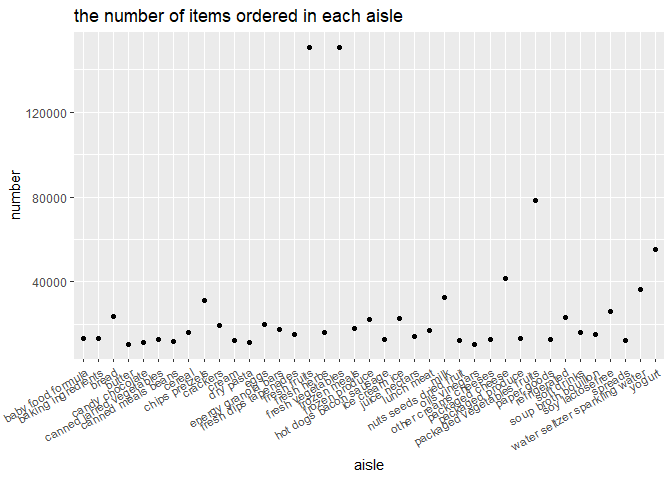

hw2\_zh2493
================
Ziqian
2021/10/4

``` r
library(tidyverse)
library(dplyr)
library(p8105.datasets)
data("instacart")
```

## Problem 1

### Q1

``` r
instacart_aisle = data.frame(table(pull(instacart, aisle)))
colnames(instacart_aisle) = c('aisle', 'number')
arrange(instacart_aisle, desc(number))
```

    ##                             aisle number
    ## 1                fresh vegetables 150609
    ## 2                    fresh fruits 150473
    ## 3      packaged vegetables fruits  78493
    ## 4                          yogurt  55240
    ## 5                 packaged cheese  41699
    ## 6   water seltzer sparkling water  36617
    ## 7                            milk  32644
    ## 8                  chips pretzels  31269
    ## 9                 soy lactosefree  26240
    ## 10                          bread  23635
    ## 11                   refrigerated  23228
    ## 12                  ice cream ice  22676
    ## 13                 frozen produce  22453
    ## 14                           eggs  19875
    ## 15                       crackers  19592
    ## 16                   frozen meals  18221
    ## 17            energy granola bars  17449
    ## 18                     lunch meat  16957
    ## 19                    soft drinks  16279
    ## 20                         cereal  16201
    ## 21                    fresh herbs  16052
    ## 22           fresh dips tapenades  15142
    ## 23            soup broth bouillon  15109
    ## 24                  juice nectars  14350
    ## 25               packaged produce  13460
    ## 26              baby food formula  13198
    ## 27             baking ingredients  13088
    ## 28           other creams cheeses  12820
    ## 29         hot dogs bacon sausage  12813
    ## 30                    paper goods  12694
    ## 31       canned jarred vegetables  12679
    ## 32         nuts seeds dried fruit  12532
    ## 33                          cream  12356
    ## 34                        spreads  12102
    ## 35             canned meals beans  11774
    ## 36                candy chocolate  11453
    ## 37                      dry pasta  11298
    ## 38                  oils vinegars  10620
    ## 39                         butter  10575
    ## 40                  cookies cakes   9980
    ## 41                  instant foods   9917
    ## 42               breakfast bakery   9851
    ## 43                     condiments   9743
    ## 44                    pasta sauce   9736
    ## 45               frozen breakfast   9729
    ## 46                            tea   9376
    ## 47              spices seasonings   9279
    ## 48        frozen appetizers sides   8870
    ## 49                         coffee   8392
    ## 50           tortillas flat bread   8353
    ## 51                        missing   8251
    ## 52                   frozen pizza   7661
    ## 53                    asian foods   7007
    ## 54                  popcorn jerky   6917
    ## 55         fruit vegetable snacks   6741
    ## 56       hot cereal pancake mixes   6352
    ## 57        grains rice dried goods   6134
    ## 58              cleaning products   5894
    ## 59               packaged poultry   5608
    ## 60                poultry counter   5208
    ## 61         preserved dips spreads   5188
    ## 62         tofu meat alternatives   5123
    ## 63                     buns rolls   5054
    ## 64           pickled goods olives   4882
    ## 65     doughs gelatins bake mixes   4758
    ## 66           energy sports drinks   4742
    ## 67        frozen vegan vegetarian   4727
    ## 68        salad dressing toppings   4719
    ## 69                        laundry   4636
    ## 70                 prepared meals   4133
    ## 71        canned fruit applesauce   3996
    ## 72              specialty cheeses   3873
    ## 73                dish detergents   3870
    ## 74                        granola   3803
    ## 75                   latino foods   3548
    ## 76            frozen meat seafood   3341
    ## 77            canned meat seafood   3241
    ## 78                   meat counter   3159
    ## 79        breakfast bars pastries   3144
    ## 80                   oral hygiene   3070
    ## 81          prepared soups salads   2936
    ## 82                   food storage   2906
    ## 83     marinades meat preparation   2905
    ## 84                  cat food care   2885
    ## 85          honeys syrups nectars   2864
    ## 86                           soap   2773
    ## 87              body lotions soap   2137
    ## 88           vitamins supplements   1969
    ## 89     plates bowls cups flatware   1959
    ## 90                  beers coolers   1839
    ## 91                          other   1795
    ## 92  refrigerated pudding desserts   1729
    ## 93                    fresh pasta   1628
    ## 94              trash bags liners   1621
    ## 95                  dog food care   1612
    ## 96      protein meal replacements   1612
    ## 97           frozen breads doughs   1532
    ## 98                  packaged meat   1526
    ## 99                bakery desserts   1501
    ## 100                     hair care   1469
    ## 101           trail mix snack mix   1463
    ## 102              cold flu allergy   1346
    ## 103                     red wines   1243
    ## 104                     digestion   1205
    ## 105                 diapers wipes   1109
    ## 106         baking supplies decor   1094
    ## 107                   white wines   1088
    ## 108               seafood counter   1084
    ## 109        air fresheners candles   1067
    ## 110             cocoa drink mixes   1062
    ## 111                 feminine care   1048
    ## 112                       spirits    967
    ## 113                      mint gum    962
    ## 114                frozen dessert    922
    ## 115              packaged seafood    909
    ## 116    muscles joints pain relief    897
    ## 117                more household    891
    ## 118                    deodorants    858
    ## 119                   facial care    746
    ## 120  bulk dried fruits vegetables    725
    ## 121                  indian foods    719
    ## 122  bulk grains rice dried goods    634
    ## 123                  kosher foods    628
    ## 124                  eye ear care    548
    ## 125                     first aid    539
    ## 126                     skin care    534
    ## 127                   shave needs    532
    ## 128            ice cream toppings    504
    ## 129    specialty wines champagnes    461
    ## 130              kitchen supplies    448
    ## 131           baby bath body care    328
    ## 132              baby accessories    306
    ## 133                  frozen juice    294
    ## 134                        beauty    287

There are 134 aisles and the most items is fresh vegetables.

### Q2

``` r
instacart_aisle %>% 
  filter(number > 10000) %>% 
  ggplot(aes(x = aisle, y = number)) +
  geom_point() +
  labs(title = "the number of items ordered in each aisle") +
  theme(axis.text.x = element_text(angle = 30, hjust = 1, vjust = 1))
```

<!-- -->

like the plot itself. it shows the number of items ordered in each aisle
which are more than 10000 items ordered.

### Q3

``` r
baking = filter(instacart, aisle == "baking ingredients") %>% 
  group_by(product_name) %>% 
  summarize(n_obs = n()) %>% 
  arrange(desc(n_obs))
baking = baking[1:3, ]

dog = filter(instacart, aisle == "dog food care") %>% 
  group_by(product_name) %>% 
  summarize(n_obs = n()) %>% 
  arrange(desc(n_obs))
dog = dog[1:3, ]

pack = filter(instacart, aisle == "packaged vegetables fruits") %>% 
  group_by(product_name) %>% 
  summarize(n_obs = n()) %>% 
  arrange(desc(n_obs))
pack = pack[1:3, ]

table1 = bind_rows(list(baking, dog, pack))
```

the three most popular items and the order number in each of the aisles
“baking ingredients”, “dog food care”, and “packaged vegetables fruits”
are Light Brown Sugar, 499, Pure Baking Soda, 387, Cane Sugar, 336,
Snack Sticks Chicken & Rice Recipe Dog Treats, 30, Organix Chicken &
Brown Rice Recipe, 28, Small Dog Biscuits, 26, Organic Baby Spinach,
9784, Organic Raspberries, 5546,Organic Blueberries,4966.

### Q4

``` r
Pink_Lady_Apples = filter(instacart, product_name == "Pink Lady Apples") %>% 
  group_by(product_name, order_dow) %>% 
  summarize(order_hour_of_day = mean(order_hour_of_day))

Coffee_Ice_Cream = filter(instacart, product_name == "Coffee Ice Cream") %>% 
  group_by(product_name, order_dow) %>% 
  summarize(order_hour_of_day = mean(order_hour_of_day))

table2 = bind_rows(list(Pink_Lady_Apples, Coffee_Ice_Cream)) %>% 
  mutate(order_dow = recode(order_dow, "0" = "Sunday", "1" = "Monday", "2"  = "Tuesday", "3" = "Wednesday", "4" = "Thursday", "5" = "Friday", "6" = "Saturday")) %>% 
  pivot_wider(names_from = order_dow, values_from = order_hour_of_day) 
```

the mean hour of the day at which Pink Lady Apples are ordered from
Sunday to Saturday are 13.44118, 11.36000, 11.70213, 14.25000, 11.55172,
12.78431, 11.93750 and the mean hour of the day at which Coffee Ice
Cream are ordered from Sunday to Saturday are 13.77419, 14.31579,
15.38095, 15.31818, 15.21739, 12.26316, 13.83333
