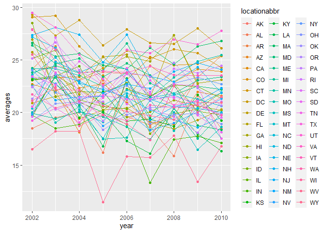
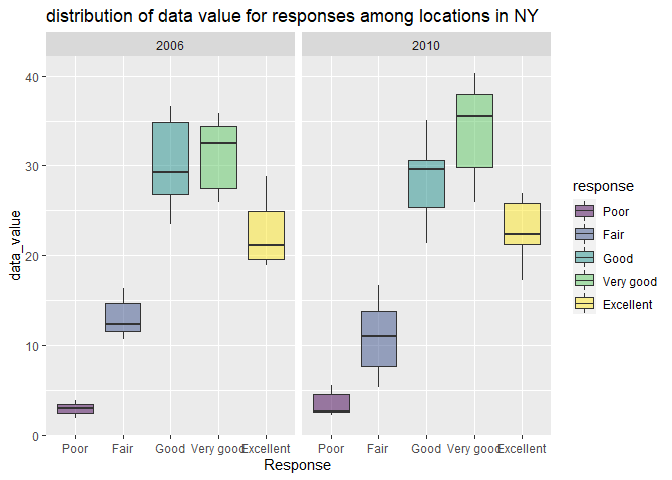
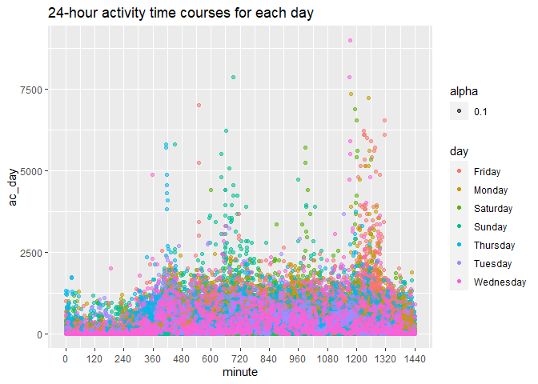

hw2\_zh2493
================
Ziqian
2021/10/4

``` r
library(tidyverse)
library(dplyr)
library(p8105.datasets)
library(ggplot2)
```

## Problem 1

### Q1

``` r
data("instacart")
instacart_aisle = data.frame(table(pull(instacart, aisle)))
colnames(instacart_aisle) = c('aisle', 'number')
arrange(instacart_aisle, desc(number)) %>%
  head() %>% 
  knitr::kable()
```

| aisle                         | number |
|:------------------------------|-------:|
| fresh vegetables              | 150609 |
| fresh fruits                  | 150473 |
| packaged vegetables fruits    |  78493 |
| yogurt                        |  55240 |
| packaged cheese               |  41699 |
| water seltzer sparkling water |  36617 |

There are 134 aisles and the most items is fresh vegetables.

### Q2

``` r
instacart_aisle %>% 
  filter(number > 10000) %>% 
  arrange(number) %>% 
  ggplot(aes(x = aisle, y = number)) +
  geom_point() +
  labs(title = "the number of items ordered in each aisle") +
  theme(axis.text.x = element_text(angle = 30, hjust = 1, vjust = 1))
```

<!-- -->

like the plot itself. it shows the number of items ordered in each aisle
which are more than 10000 items ordered.

### Q3

``` r
baking = filter(instacart, aisle == "baking ingredients") %>% 
  group_by(product_name) %>% 
  summarize(n_obs = n()) %>% 
  arrange(desc(n_obs))
baking = baking[1:3, ]

dog = filter(instacart, aisle == "dog food care") %>% 
  group_by(product_name) %>% 
  summarize(n_obs = n()) %>% 
  arrange(desc(n_obs))
dog = dog[1:3, ]

pack = filter(instacart, aisle == "packaged vegetables fruits") %>% 
  group_by(product_name) %>% 
  summarize(n_obs = n()) %>% 
  arrange(desc(n_obs))
pack = pack[1:3, ]

table1 = bind_rows(baking, dog, pack)
```

the three most popular items and the order number in each of the aisles
“baking ingredients”, “dog food care”, and “packaged vegetables fruits”
are Light Brown Sugar, 499, Pure Baking Soda, 387, Cane Sugar, 336,
Snack Sticks Chicken & Rice Recipe Dog Treats, 30, Organix Chicken &
Brown Rice Recipe, 28, Small Dog Biscuits, 26, Organic Baby Spinach,
9784, Organic Raspberries, 5546,Organic Blueberries,4966.

### Q4

``` r
Pink_Lady_Apples = filter(instacart, product_name == "Pink Lady Apples") %>% 
  group_by(product_name, order_dow) %>% 
  summarize(order_hour_of_day = mean(order_hour_of_day))

Coffee_Ice_Cream = filter(instacart, product_name == "Coffee Ice Cream") %>% 
  group_by(product_name, order_dow) %>% 
  summarize(order_hour_of_day = mean(order_hour_of_day))

table2 = bind_rows(list(Pink_Lady_Apples, Coffee_Ice_Cream)) %>% 
  mutate(order_dow = recode(order_dow, "0" = "Sunday", "1" = "Monday", "2"  = "Tuesday", "3" = "Wednesday", "4" = "Thursday", "5" = "Friday", "6" = "Saturday")) %>% 
  pivot_wider(names_from = order_dow, values_from = order_hour_of_day) 
```

the mean hour of the day at which Pink Lady Apples are ordered from
Sunday to Saturday are 13.44118, 11.36000, 11.70213, 14.25000, 11.55172,
12.78431, 11.93750 and the mean hour of the day at which Coffee Ice
Cream are ordered from Sunday to Saturday are 13.77419, 14.31579,
15.38095, 15.31818, 15.21739, 12.26316, 13.83333

## Problem2

### do some data cleaning

``` r
data("brfss_smart2010")
brfss = brfss_smart2010 %>% 
  janitor::clean_names() %>%
  filter(topic == "Overall Health", response %in% c("Excellent", "Very good", "Good", "Fair", "Poor")) %>% 
  mutate(response = ordered(response, levels = c("Poor", "Fair", "Good", "Very good", "Excellent")))
```

### do or answer

``` r
state2002 = 
  brfss %>% 
  filter(year == "2002") %>% 
  group_by(locationabbr, locationdesc) %>% 
  summarize(n_obs = n()) %>% 
  summarize(n_obs = n()) %>% 
  filter(n_obs >= 7)

state2010 = 
  brfss %>% 
  filter(year == "2010") %>% 
  group_by(locationabbr, locationdesc) %>% 
  summarize(n_obs = n()) %>% 
  summarize(n_obs = n()) %>% 
  filter(n_obs >= 7)
```

In 2002, CT, FL, MA, NC, NJ, PA states were observed at 7 or more
locations. in 2010, CA,CO,FL, MA, MD, NC, NE, NJ, NY, OH, PA, SC, TX, WA
were observed at 7 or more locations.

``` r
dataset1 = 
  brfss %>% 
  filter(response == "Excellent") %>% 
  group_by(locationabbr, year) %>% 
  summarize(averages = mean(data_value))

ggplot(data=dataset1, aes(x=year, y=averages, group=locationabbr)) +
    geom_line(aes(color=locationabbr)) +
    geom_point(aes(color=locationabbr))
```

    ## Warning: Removed 3 row(s) containing missing values (geom_path).

    ## Warning: Removed 4 rows containing missing values (geom_point).

<!-- -->

like the plot itself. with 443 variables. the spaghetti shows the
average value over time within a state.

``` r
ny = 
  brfss %>% 
  filter(locationabbr == "NY", year %in% c("2006", "2010")) %>%
  group_by(response) %>% 
  select(locationabbr, response, data_value, year)

ny %>% 
  ggplot(aes(x = response, y = data_value, fill = response)) +
  geom_boxplot(alpha = .5) +
  facet_grid(. ~ year) +
  labs(
    x = "Response",
    y = "data_value",
    title = "distribution of data value for responses among locations in NY"
  )
```

<!-- --> the
boxplot show the distribution of 75 observations in 2006 and 2010.

## P3

### tidy, and otherwise wrangle the data

``` r
data1 = 
  read.csv("./data/accel_data.csv") %>% 
  janitor::clean_names() %>%
  mutate(date = ifelse(day %in% c("Monday", "Tuesday", "Wednesday", "Thursday", "Friday"), "weekday", "weekend")) %>% 
  relocate(week, date, day_id)
```

this data includes 35 observations and the includes 1444 variables with
week, date, day\_id, day and activity1-activity1440

``` r
data2 = 
  data1 %>% 
  pivot_longer(cols = starts_with("activity"), names_to = "ac_name", values_to = "ac_day") %>% 
  group_by(date, day_id, week) %>% 
  summarize(ac_count = sum(ac_day))
```

    ## `summarise()` has grouped output by 'date', 'day_id'. You can override using the `.groups` argument.

``` r
head(data2) %>% 
  knitr::kable()
```

| date    | day\_id | week | ac\_count |
|:--------|--------:|-----:|----------:|
| weekday |       1 |    1 | 480542.62 |
| weekday |       2 |    1 |  78828.07 |
| weekday |       5 |    1 | 355923.64 |
| weekday |       6 |    1 | 307094.24 |
| weekday |       7 |    1 | 340115.01 |
| weekday |       8 |    2 | 568839.00 |

the ac\_count shows the total activity over a day and there are 35 days.

``` r
data3 = 
  data1 %>% 
  pivot_longer(cols = starts_with("activity"), names_to = "minute", names_prefix = 'activity_', values_to = "ac_day") %>% 
  mutate(minute = as.numeric(minute)) 

data3 %>% 
  ggplot(aes(x = minute, y = ac_day)) +
  geom_point(aes(color = day, alpha = .1)) +
  scale_x_continuous(
  breaks = c(seq(from = 0, to = 1440, by = 120)),
  labels = c(seq(from = 0, to = 1440, by = 120)
)) +
  labs(title = "24-hour activity time courses for each day"
  )
```

<!-- -->

the graph shows that the people’s activity times in everyday and during
the weekend, he is more active.
